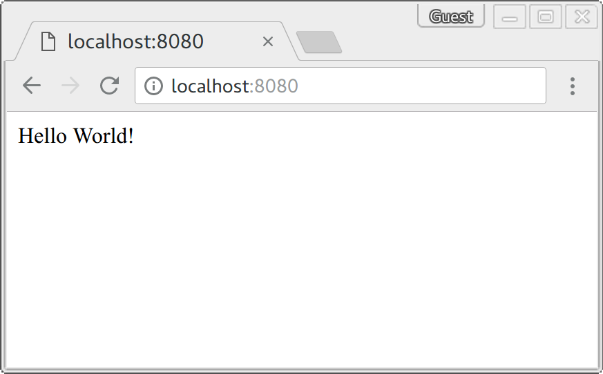

# Teste para Desenvolvedor Sênior Back-end - 

[![PHP Version][ico-php-version]](https://hub.docker.com/_/php)
[![NGINX Version][ico-nginx-version]](https://hub.docker.com/_/nginx)

This is a simple example for running a docker container with PHP-FPM and NGINX.

## Get it up and running

[Install docker on your machine.][install-docker]

[Install docker-compose on your machine.][install-docker-compose]

Clone this repository.

``` bash
$ git clone https://github.com/
```

Switch to the cloned directory.

``` bash
$ cd docker-nginx-php-example
```

Start the stack.

``` bash
$ docker-compose up
```


Visit `localhost:8080` in your browser. You should see an output like this.



## License

The MIT License (MIT). Please see [License File](LICENSE.md) for more information.

[ico-license]: https://img.shields.io/badge/license-MIT-brightgreen.svg?style=flat-square
[ico-php-version]: https://img.shields.io/badge/PHP-7.4--fpm-blue?style=flat-square
[ico-nginx-version]: https://img.shields.io/badge/NGINX-1.17-green?style=flat-square
[install-docker]: https://docs.docker.com/engine/installation
[install-docker-compose]: https://docs.docker.com/compose/install
